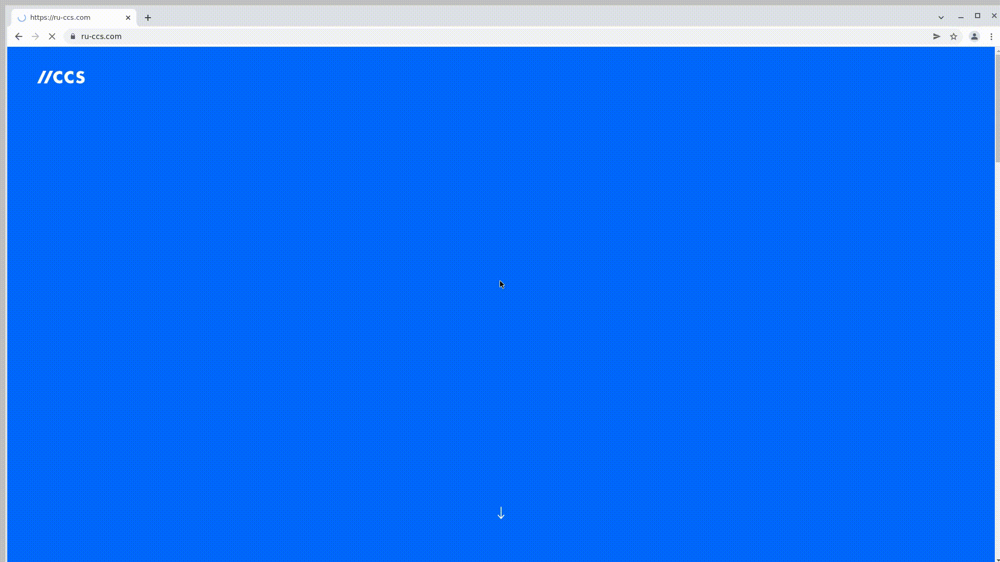

# Hi there!
This is the test of CCS company site that I wrote for introducing myself and to compete to the QA automation engineer vacancy in this company.

# Jenkins job
<a target="_blank" href="https://jenkins.autotests.cloud/job/C12-Snark-CCS_site_test/">There you may run the tests by yourself</a>

<a target="_blank" href="https://jenkins.autotests.cloud/job/C12-Snark-CCS_site_test/allure/">Allure report</a>

# For example, test all sections links

<p></p>

### For run remote tests need fill remote.properties or to pass value:

* browser (default chrome)
* browserVersion (default 89.0)
* browserSize (default 1920x1080)
* browserMobileView (mobile device name, for example iPhone X)
* remoteDriverUrl (url address from selenoid or grid)
* videoStorage (url address where you should get video)
* threads (number of threads)


Run tests with filled remote.properties:
```bash
gradle clean test
```

Serve report:
```bash
allure serve build/allure-results
```

For runing all tests use
```bash
.gradlew clean testCCSSite
``` 

For runing the links check for site sections use
```bash
.gradlew clean testSiteSections
```

For runing the "Service" section test use
```bash
.gradlew clean testSectionServices
```

# Notifications

You may receive notification about test status in Telegram.
For receiveing notifications <a target="_blank" href="https://t.me/+riUIEOt4kjswODYy">join this group</a>

Notifications will be sent every time when <a target="_blank" href="https://jenkins.autotests.cloud/job/C12-Snark-CCS_site_test/">this Jenkins job</a> will be run

For more information about configure and using notifications <a target="_blank" href="https://github.com/qa-guru/allure-notifications">visit developers page</a>

:heart: <a target="_blank" href="https://qa.guru">qa.guru</a><br/>
:blue_heart: <a target="_blank" href="https://t.me/qa_automation">t.me/qa_automation</a>
